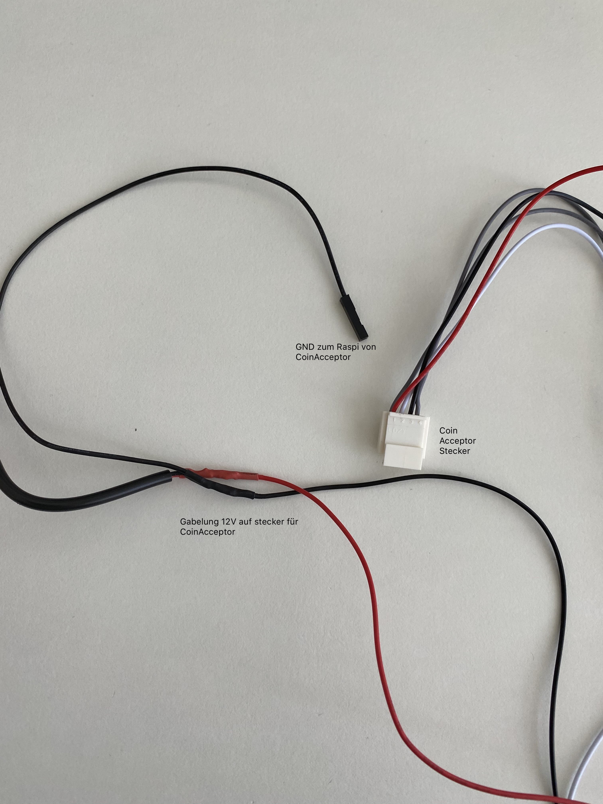

# lightning atm

## introduction

During the internship at Puzzle, one of the project in the BBT was building a Lightning ATM machine. Trying to be a forerunner in Lightning technology, Puzzle has already build a [snack machine](https://www.puzzle.ch/de/blog/articles/2018/09/18/puzzle-itc-und-energy-kitchen-machen-es-moeglich-schnelle-bezahlung-mit-bitcoin-purer-genuss-ist-garantiert), a Beer tap and has done other things. See all lightning related blog posts [here](https://www.puzzle.ch/de/blog/categories/strategische-themen/lightning). Initialized by Raffael Hertle, introduced by Gabriel Comte, we, Luca Brügger and I, started building the Lightning ATM machine.

Essentially, we had to get all the parts and follow an excellent tutorial by **21isenough**.



## result

_wip_

## getting started

The Lightning ATM machine consists of basically a Raspberry Pi with corresponding software on it, a coin acceptor correctly configured and connected, properly supplied with power  and everything neatly wrapped up in a case.

1. [getting all parts](lightning-atm.md#parts-list)
2. [raspberry pi setup](lightning-atm.md#raspberry-pi)
3. [display](lightning-atm.md#display)
4. [power supply](lightning-atm.md#power-supply)
5. [coin acceptor](lightning-atm.md#coin-acceptor)

## parts list

Based on this [list](https://docs.lightningatm.me/requirements/hardware-requirements), however without the camera and button.

* raspberry
  * wifi adapter if raspberry is older and has none
* display
  * band cable \(between display and display platine\)
  * jumper cables to connect to raspberry
* case
* coin acceptor
  * jumper cables to connect to raspberry
* power supply \(rasperry needs 5V, coin acceptor needs 12V\)
  * 5 -&gt; 12 V transformer
  * micro usb .... wip

## raspberry pi

* [Doc Tutorial](https://docs.lightningatm.me/lightningatm-setup/hardware-setup/assembly-and-software)

### setup

* [Video at setup position ](https://youtu.be/A9JKUQvvmYM?t=557)

### **connect**

1. IP addresse herausefinden: `$ping raspberrypi.local` sollte den Raspberry finden und anpingen.
2. Mit SSH verbinden: `$ ssh pi@ip_address`  Passwort: `l1ghtning`

* `$ sudo poweroff` \(erst vom Netz nehmen, wenn grünes Lämpchen nicht mehr leuchtet\)
* `$ sudo reboot`

### pins


### tmux

To be able to have multiple consoles open with ssh, the program `tmux` is used. Primarily to monitor the log file while simultaneously be able to enter commands.

#### links

* [Doc Tutorial](https://docs.lightningatm.me/lightningatm-setup/software-setup/monitoring_log_file)
* [Cheatsheet Tmux](https://tmuxcheatsheet.com/)

### monitoring log file

```text
tail -f ~/.lightningATM/debug.log
```

## display

The display need to be connected to the raspberry pi with jumper cables. In theory, it can be just attached atop the raspberry, the pins match up correctly. However, if we want the display properly in the case, jumper cables are needed.

#### links

* [Doc Tutorial](https://docs.lightningatm.me/lightningatm-setup/hardware-setup/raspberry-pi-and-display)

## power supply

The raspberry pi and the coin acceptor both need to be powered and this can be done for both separately. However, we want to combine them and have just one input power supply. This is impeded by the devices needing different voltages, the raspberry pi 5V, the coin acceptor 12V.

To solve this we tinkered around. We cut open general DC12V converter on several locations and forked the cables to have one parallel circuit before the conversion, that goes through the raspberry. 


Warning, following section don't understand yet, how Luca accomplished this.


After the conversion it's also forked to be able to connect to the GND of the raspberry for some reason.




## coin acceptor

When the coin acceptor has power, it needs to be configured. It must learn what coins will be inserted. This is a somehow tedious process, yet nicely explained in this [video](https://youtu.be/14JfEhNSdZE?t=1405).

#### links

* [ Doc Tutorial](https://www.youtube.com/watch?v=14JfEhNSdZE&feature=youtu.be)

## wallet

_wip_

## references








